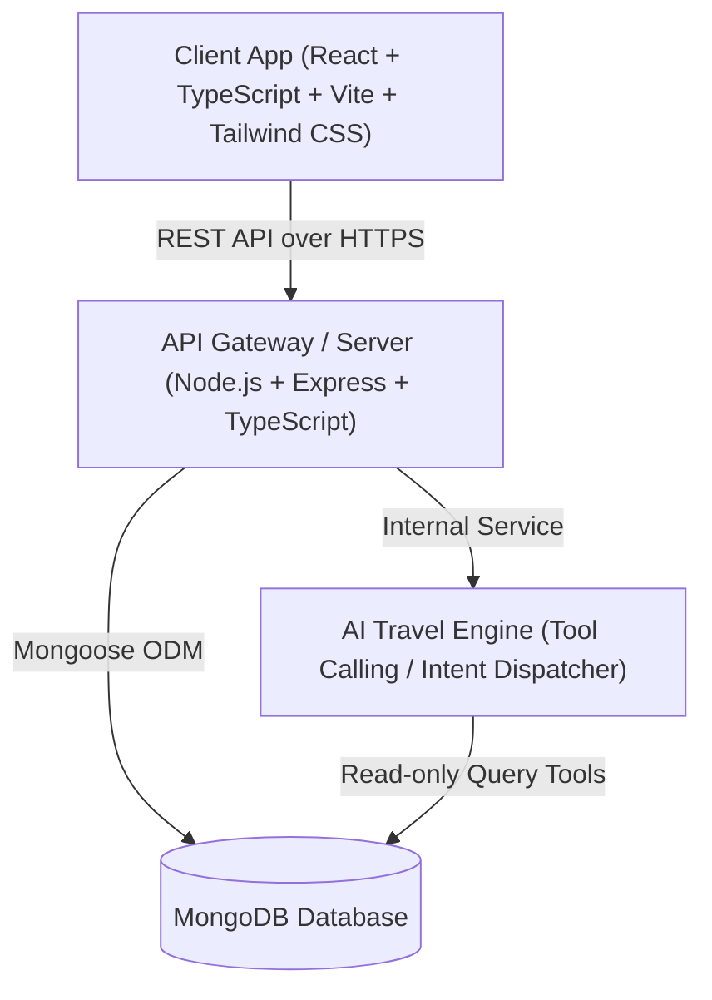

# System Architecture — Natarajan Travel Agency

## 1. Overview & Vision
**Natarajan Travel Agency** is a full-stack digital car booking and travel agency platform designed with modern MERN architecture, responsive UI, micro-animations, and an intelligent AI assistant.

This document serves as the foundational architectural blueprint for all technical decisions, system boundaries, patterns, and workflows.

---

## 2. High-Level System Architecture



---

## 3. Tier Breakdown

### 3.1 Client Tier (Frontend)
- **Framework**: React 18+ with TypeScript, bundled using Vite.
- **Routing**: `react-router-dom` v6 with layouts (`MainLayout`, `AdminLayout`).
- **Styling**: Tailwind CSS with customized color palettes, modern typography, elevation tokens, and generous spacing.
- **Animations**: `framer-motion` for micro-interactions, page transitions, and smooth scroll effects; modular placeholder wrappers for upcoming 3D/Spline vehicle animations (`CarAnimationLeft`, `CarAnimationRight`).
- **Icons**: `lucide-react`.
- **State & Data Fetching**: Standardized typed fetch/Axios service layer with optimistic updates and robust error boundaries.

### 3.2 Server Tier (Backend)
- **Runtime & Framework**: Node.js, Express.js with TypeScript (`strict: true`).
- **Layered Architecture**:
  ```
  Request -> Security Middleware (Helmet/CORS) -> Request Logger -> Routes -> Controller -> Service -> Model -> Database
  ```
- **Error Handling**: Centralized `errorHandler` middleware catching custom `AppError` instances with standardized JSON responses.
- **Security**: `helmet`, `cors`, input sanitization, rate limiting, and JWT authentication with role authorization.

### 3.3 Database Tier (Persistence)
- **Database**: MongoDB with Mongoose ODM.
- **Indexes**: Compound and single-field indexes on searchable fields (e.g. `category`, `pricePerDay`, `available`, `pickupDate`).

---

## 4. Key Architectural Patterns & Decisions

1. **Standardized API Response Pattern**:
   All API endpoints return consistent envelopes:
   - Success:
     ```json
     {
       "success": true,
       "message": "Operation completed successfully",
       "data": { ... }
     }
     ```
   - Error:
     ```json
     {
       "success": false,
       "message": "Error description",
       "errors": [ ... ]
     }
     ```

2. **Animation Strategy & Mobile Degradation**:
   - Complex 3D car animations are abstracted behind `CarAnimationLeft` and `CarAnimationRight`.
   - On low-power devices and mobile viewports, the application gracefully renders lightweight SVG/CSS motion illustrations to preserve 60 FPS performance and avoid battery drain.

3. **AI Chatbot Guardrails**:
   - The AI assistant connects to verified backend read tools (`searchCars`, `checkAvailability`, `getFaqAnswer`).
   - The assistant is forbidden from hallucinating pricing, policies, or booking confirmations.

---

## 5. Security & Configuration
- **Zero Committed Secrets**: `.env` files are ignored via `.gitignore`; strictly documented via `.env.example`.
- **Validation**: Schema-level validation in Mongoose plus request body validation before reaching controllers.
