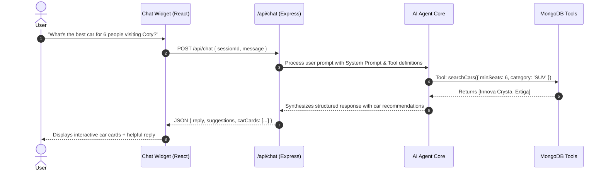

# AI Chatbot Assistant Architecture — Natarajan Travel Agency

## 1. Goal & Responsibilities
The **Natarajan AI Travel Assistant** is designed to provide instantaneous, 24/7 conversational assistance to prospective travelers and car rental customers.

### Scope of Assistance:
1. Recommending suitable car models based on passenger count, luggage, terrain, or budget.
2. Answering common agency policies (fuel policy, driver allowance, cancellation policy, security deposit).
3. Sharing package itinerary overviews.
4. Guiding customers through the booking reservation process.

---

## 2. Architecture & Tool-Calling Pipeline

---

## 3. Tool Function Definitions

| Tool Name | Parameters | Purpose |
| :--- | :--- | :--- |
| `searchCars` | `category`, `seats`, `maxPrice` | Query current active car fleet |
| `checkAvailability` | `carId`, `startDate`, `endDate` | Verify car calendar booking slots |
| `calculateEstimate` | `carId`, `days`, `withDriver` | Compute accurate price breakdown |
| `getPackageDetails` | `destination` | Fetch travel package info |
| `getFAQAnswer` | `query` | Fetch verified agency policy answer |

---

## 4. Strict Safety Guardrails
1. **No Phantom Pricing**: Never calculate or state a custom price outside the verified `calculateEstimate` tool.
2. **No False Booking Confirmations**: The AI must inform the user that their request is submitted for agency review and is not confirmed until approved.
3. **Escalation**: When in doubt or when user requires customized outstation tours, offer direct phone/WhatsApp contact links.
